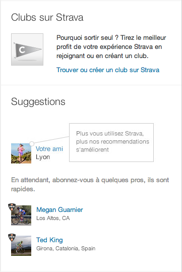

# Analyse de l'existant

Cette partie est consacrée à l'analyse des sites existants qui offre un service comparable à celui de Sport fun (ou en partie). C'est une partie très importante qui permet de voir ce qui a déjà été réalisé et de quelle manière.

Dans la plupart des projets, l'idée a déjà été trouvée, réalisée, améliorée, modifiée, le concept principal n'est pas de trouver l'idée du siècle (même si çela peut toujours être un plus), mais ce qui est important, c'est de quelle façon le produit sera proposé à l'utilisateur, concrètement, d'une manière à lui donner l'expérience la plus agréable et efficace mais également facile d'utilisation et plaisante.

C'est donc important d'analyser les sites du même domaine qui ont déjà été réalisés. Voir s'ils ont réussi et si oui, pourquoi, retenir les points forts et les points faibles pour, finalement, en reprendre le meilleur et améliorer les faiblesses.

### [GoRunning](http://www.gorunning.be/index_fr.php)

GoRunning est un site sur la course à pied. Il propose plusieurs services:

-	Calendrier d'évènements
	
	Leur calendrier est intuitif et les informations pour chaque évènement sont très détaillées. Malheureusement, ils ne permettent pas de voir les tracés sur une carte. Et finalement; je trouve (c'est un avis personnel) que la mise en page est fort brute. Le formulaire d'encodage d'information est extrêment long.
	
	
	
	Un point fort est la création d'une section pour les organisateurs.
	
-	Liste de magasins

	C'est une bonne idée à garder à l'esprit pour les prochaines fonctionnalités.

### [Chronnorace](http://www.chronorace.be/web2/default.aspx)

Chronorace est un fournisseur du matériel de chronométrage pour les courses. Ils proposent donc tous les résultats utilisant leur matériel sur leur site. C'est une mine d'informations pour tout coureurs voulant garder une trace de ses résultats.

Leur site est fort basic car ils proposent beaucoup d'informations à la fois. Mais il à l'air de bien fonctionner auprès des coureurs vu que beaucoup de sites renvoient leurs utilisateurs ici pour les résultats d'évènements.

### [Mapometer](gb.mapometer.com)

Mapometer est un site de création de tracé. C'est surtout l'interface qu'ils ont dévelopé avec google map qui est intéressante. L'utilisateur a à sa  disposition une quantité d'outils imprésionante. Parfois ça devient même un peu trop compliqué; un accompagnement pour les nouveaux utilisateurs serait un plus.

### [Strava](www.strava.com)

Strava est un site qui accompagne les sportifs prendant et après leurs entrainements. Ce site a vraiment su cibler son public et lui donner exactement ce dont il avait besoin. Cela va de la récupération des données de course (tracé, allure, dénivellé, fréquence cardiaque) à l'analyse de celle ci et l'interaction avec les autres utilisateurs. Et comme bonnus, ils organisent des challenges ou ils mettent les utilisateurs au défit et les gagants remportent des cadeaux.

J'ai passé beaucoup de temps sur ce site pour prendre de l'inspiration, observer leur interfaces et utiliser leur site pour m'entrainer. Leur interface de création de tracé est aussi très bien développée; les contrôles sont intuitifs et l'aide est bien présente pour guider les utilisateurs.

J'ai repris beaucoup d'idées de ce site; comme l'organisation globale de la page et des menu de navigation. 

Un des points fort de leur site est qu'il insite l'utilisateur à participer. Il y a des suggestions d'autres utilisateurs à suivre, de rechercher des clubs, proposer des challenges.

Ils proposent aussi une section «shop» où ils vendent leurs produits de sport. Ils en profitent pour placer leur propres publicités en bas de page.

### [Runtastic](www.runtastic.com)

Runtastic est aussi un site qui accompagne les sportifs durant leurs entrainements. Il est beaucoup utilisé par les amateurs. C'est parce que le site est plus poussé au niveau de l'accompagnement et la motivation que sur l'analyse des entrainements (ils proposent aussi une analyse des performances).

### [Openrunner](www.openrunner.com)

Openrunner est un site d'organisation de randonnées/trails(?). Il cible surtout les personnes pratiquant ce sport à la montagne. Car il propose de détailler les chemins et l'altitude avec une précision extrême. 

### [CalculItinéraires](www.calculitineraires.fr)

CalculItinéraires est un site spécialisé sur la création de tracés. Ils mettent à disposition des utilisateurs un nombre de fonctions impréssionnant. Comme par exemple, la possibilité de changer de map (passer de Google map à Open Street Map). Il y a aussi beaucoup d'informations sur les tracés créés; outre l'élévation ils proposent de calculer les calories brulées, le temps en fonction de l'allure,… 

Je ne prévois pas de donner autant d'informations sur les tracés.

## Conclusion

Tous ces sites ont des qualités et des défaults. Après avoir longtemps parcouru chaqun, j'ai pu créer une liste des points forts et une des erreurs à éviter. Cette liste m'a guidé dans mon travail et m'a permis d'éviter les erreurs avant de les commetre. 

### Points forts à retenir

-	Accompagner les nouveaux utilisateurs lors la création de tracé.
-	Rendre la création de tracé la plus simple possible.
-	Pouvoir changer le fond de la map.
-	Insiter les utilisateurs à faire des actions.
-	Interface simple et intuitive.
-	

### Erreurs à éviter

-	Demander trop d'informations d'un coup aux utilisateurs (long formulaires).
-	Créer des interfaces complexes.
-	
