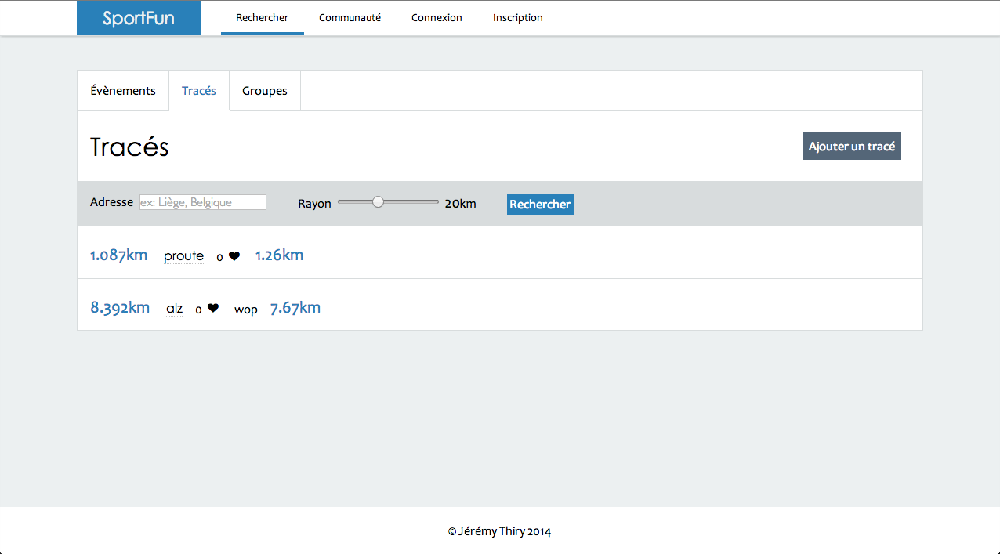

# Conception de l'interface

Cette partie reprend les étapes par lesquelles je suis passé pour la conception de l'interface. Beaucoup de points sont directement liés à l'observations des sites dan le chapitre précédant.

## Maquettes zoning

Une des première étape est de réaliser des maquettes. C'est important pour ne pas se lancer aveuglément dans le design, et gagner de temps. Cela permet aussi de prévoir l'emplacement des fonctionnalités et l'architècture générale de la page. En début d'année j'avais fait une série de zonning, maintenant beaucoup de choses on changés.

L'idée était de présenter ces conceptes à la classe pour que l'on discute ensemble. Ces brainstormings on permis à chaque étudiants d'avancer énormément dans la pré-conception de leur interface. Personnellement, beaucoup de commentaires reçu ce jour la m'ont ouvert les yeux sur certain défauts de conceptions. J'ai aussi reçu beaucoup d'idées de fonctionnalités. En conclusion, cette partie m'apporta beaucoup et me fit changer plusieurs mauvais choix que j'avais fait: voici les maquettes avant la réunion, et le site en suivant les conseils.

## Navigation
La navigation du site est composée de deux niveaux différents. La navigation principale située en haut de page, permet d'accéder aux différentes sections principales. Ensuite, au niveau du contenu se situe la navigation secondaire, qui elle, est différente en fonction de la section.

Exemple: 

Utilisateur non connecté sur la section recherche.

Utilisateur non connecté sur la partie communauté.

Utilisateur non connecté sur le profil d'un autre utilisateur.

Utilisateur connecté sur son tableau de board.

J'ai choisi ce type de navigation pour simplifier la navigation dans le site. Pour ce faire j'ai du déterminer les sections principales du site (à l'aide de résultats de tests utilisateurs). De cette façon, si l'utilisateur veut rechercher quelque chose, il ne sera pas dérangé par les actions des autres sections.

## Couleurs

Voici la palette couleur du site.

Les couleurs sélectionnées sont des couleurs vives, offrant de bon contrastes.

## Typographie

text: Candara, Calibri, Segoe, "Segoe UI", Optima, Arial, sans-serif
titres: "Century Gothic", CenturyGothic, AppleGothic, sans-serif

## Contenus non-textuels

Icones fontello

## Adaptabilité

Il est important que le site s'adapte en fonction des conditions des utilisateurs. Qu'ils soient sur un smartphone, sur une tablette, ou sur un pc, le site doit pouvoir proposer ses services d'une manière convenable.

On oublie aussi souvent les utilisateurs qui n'ont pas javascript (ceux qui utilisent un lecteur d'écran par exemple). Il faut donc penser aussi à la dégradabilité du site.

### Responsive

Le site est responsive pour être utilisable sur n'importe quel appareil. J'ai donc créé une grille de base (avec «neat»), et cette grille s'adapte en fonction de plusieurs points.

- 1080px

- 935px

- 700px

- 480px

- 300px

### Dégradable

J'ai fait en sorte que les utilisateurs ne soient pas bloqués sans javascript. C'est à dire que les fonctionnalités de base fonctionnent sans javascript activé, et elles sont enrichies à son activation.

Prennons par exemple la liste des tracés sur la carte. Si jamais l'utilisateur ne dispose pas de javascript, je supprime la carte vu qu'elle ne fonctionnera pas, et je lui donne la liste des tracés.

Exemple: Avec JavaScript

Et sans javascript

Une des seule partie qui n'est pas entièrement dégradable est la création de tracé. Evidement, si l'utilisateur n'a pas javascript il ne pourra pas créer de tracé sur la map. Néanmoins je peux toujours lui proposer de créer son tracé à partir d'un fichier.