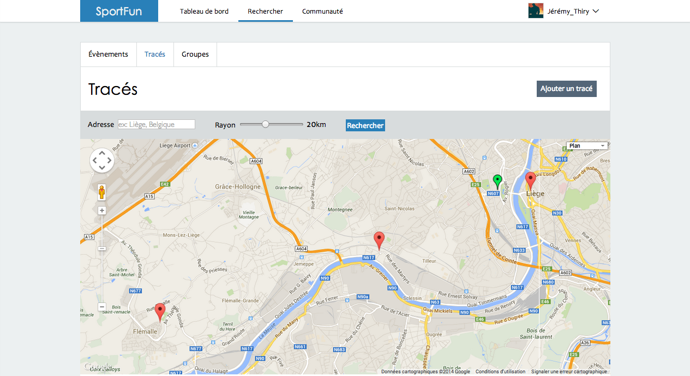

# Utilisabilité
## Tâches

Description des tâches à effectuer par les testeurs.

### 1. Utilisateur primaire

1. Créer un compte en utilisant l'interface du site.
	- Changer sa photo de profil.
	- Ajouter des informations personnel.

2. Ajouter un entrainement.
	- Créer un évènement.
	- Ajouter un tracé à cet évènement.
	- Participer à l'évènement.
	- Télécharger le tracé d'entrainement.
	- Partager l'entrainement sur twitter.

3. Participer à une course.
	- Trouver une course près de chez lui à des dates qui lui conviennent.
	- Participer à la course.
	- Poster un forum sur cette course pour demander l'avis d'autres utilisateurs.

### 2.Utilisateur secondaire

1. Créer un compte en utilisant l'interface du site.
	- Changer sa photo de profil.
	- Ajouter des informations personnel.

2. Rechercher un tracé d'entrainement.
	- Trouver un tracé sur la carte d'exploration.
	- Inspecter les informations sur la page du tracé.
	- Ajouter le tracé au favoris.
	- Télécharger le tracé.
	- Partager le tracé sur google+
	
3. Rechercher un groupe d'entrainement.
	- Trouver un groupe d'entrainement qui lui convient.
	- Demander de faire partie du groupe.
	- Participer à un évènement de groupe.
	
### 3.Utilisateur tertiaire.

1. Créer un compte via facebook.
	- Modifier les paramètre du compte.

2. Trouver une course intéressante.
	- Participer à la course.
	- Partager la course sur facebook.

## Tests utilisateurs

### 1.
___

#### M.

#### D.

#### M.

#### Conclusion après les premiers tests

Trouver un tracé sur la carte n'est pas intuitif. L'utilisateurs ne pense pas à cliquer sur les marqueurs car ils ne sont pas affordants. Il faudrait soit les rendre plus affordant, soit indiquer des informations au survol ou bien mettre la liste des tracés sur une colonne.

Encore plus accompagner les utilisateurs lors de la création des tracés.

Suivit des utilisateurs lors du remplissage des formulaires. Beaucoup perdent du temps car ils ne remplissent pas un champ obligatoire, ou bien créent un mot de passe trop court. Donc il faut prévenir les utilisateurs des champs obligatoires et informer de la spécificité des champs. L'aide aux formulaires est une étape importante qui influence beaucoup la satisfaction des utilisateurs. Je dois améliorer ce point pour les tests suivants.

Multiplier les chemins d'accès aux actions. C'est-à-dire qu'il ne doit pas y avoir qu'un seul chemin pour créer un tracé. Il faut donc ajouter des liens pour ces actions sur la page d'acceuil, sur le tableau de bord de l'utilisateur. De la sorte il aura plus de chance de cliquer directement sur le bon lien.

Rappeller l'évènement sur lequelle on crée un tracé. L'utilisateur est perdu quand il veut créer un tracé depuis un évènement, et que sur la page de création, plus rien ne rappelle cet évènement.

### 2.
___

#### S.

L'utilisateur à effectué les tâches d'un utilisateur secondaire.

##### Créer un tracé.

Ajouter un tracer ensuite poster une image pour ajouter des informations.

Temps: 2min.

L'utilisateur à vite pris en main l'interface, 

3. trouver évènement, participer, poster forum.
style forum formulaire
N'as pas compris le fonctionnement des forums.
2min

#### T.

#### P.

###2.
1. Créer compte
3min
-> Prévenir longueur des mot-de-passe
-> facilité globale, trouve rapidement les formulaires
->montrer en direct le changement d'image
2.
3min.

#### Conclusion après les seconds tests

Les améliorations ont portés leur fruits. Les utilisateurs exécutent les tâches plus rapidement. Car ils trouvent plus vites l'endroit ou faire ces actions. J'ai aussi mult

### Compte rendu général des tests

C'est tests utilisateurs m'ont permit d'améliorer la qualité générale du site. Cela m'a aussi ouvert les yeux sur de grosses erreurs de conceptions et ainsi donné l'occasion de rectifier le tir.

